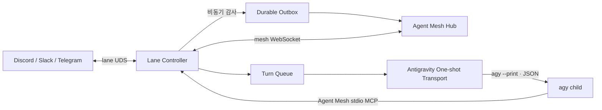

# Antigravity CLI Runtime Adapter 설계

> 상태: Feedback Draft / 구현 전
>
> 최종 갱신: 2026-08-15
>
> 입력 자료: 사용자 제공 Antigravity CLI 실험 문서
>
> 검증 기준: 로컬 `agy 1.1.13` 및 Google Antigravity CLI 공식 문서
>
> 이 문서는 기존 `GEMINI_RUNTIME_ADAPTER_DESIGN.md`의 ACP 설계를 대체한다.

## 1. 목적과 결론

Gemini CLI ACP 파일럿의 공통 메시 계층은 보존하되, 지원이 중단된 개인용 Gemini CLI 경로를 Antigravity CLI의 원샷 headless 실행으로 교체한다.

핵심 결론은 다음과 같다.

- 별도의 Antigravity adapter daemon을 만들지 않는다.
- 호스트당 하나인 `agent-meshd` 내부 Lane Controller가 Antigravity Runtime Transport를 소유한다.
- 상주 `agy` child나 ACP session은 없다. 메시지 한 턴마다 `agy --print --output-format json`을 한 번 실행한다.
- Hub mesh와 Channel Driver inbound는 같은 정규화·queue·correlation 경로를 사용한다.
- 응답은 하나의 JSON envelope로 수집한다. ACP chunk 조립, thought event 필터와 오염된 session 교체는 폐기한다.
- Antigravity는 여러 모델 계열을 선택할 수 있으므로 identity를 특정 모델 벤더로 분류하지 않는다.
- runtime turn의 기본 timeout은 `30분`(`1800초`)이다. Hub Blob upload의 시도별 `180초` timeout과 서로 독립적이다.
- Hub 감사 장애는 active Antigravity turn, conversation 또는 Channel Driver 직접 경로를 중단하지 않는다.

현재는 설계 단계다. 파일럿 자료의 인증과 단발 호출 결과는 참고하되, Agent Mesh 통합 왕복·sandbox·MCP 권한은 구현 착수 후 다시 실증해야 한다.

## 2. 전환 배경과 의존성

Google은 2026-06-18부터 개인용 Gemini CLI consumer 인증 경로를 Antigravity CLI로 전환했다. Enterprise 및 API-key 기반 경로는 별도다. 따라서 구 Gemini CLI `--experimental-acp`를 신규 클라이언트의 지원 전제로 삼지 않는다.

외부 의존성은 다음처럼 문서화하고 compatibility probe로 확인한다.

| 의존성 | 설계 기준 | 처리 |
|---|---|---|
| CLI | `agy` | TUI/doctor가 존재와 version 확인 |
| 검증 baseline | `1.1.13` | 고정 영구 요구가 아니라 검증된 기준점 |
| 실행 방식 | headless one-shot | 실제 `--help`와 smoke probe로 capability 확인 |
| 인증 | OAuth 또는 공식 API-key 설정 | credential 값을 Agent Mesh가 복사·로그하지 않음 |
| MCP | Antigravity local stdio MCP | workspace 설정을 `agent-mesh`가 생성·병합 |
| 모델 | 계정과 CLI가 제공하는 동적 목록 | contract에 모델 목록을 하드코딩하지 않음 |

`agy` 설치는 npm package가 아니다. TUI는 공식 설치 경로를 안내하고 사용자의 명시적 동의 없이 pipe-to-shell installer를 실행하지 않는다.

## 3. 기준 아키텍처



### 3.1. Lane Controller가 담당할 것

- lane identity, Ed25519 key와 Hub connection
- Channel Driver UDS 연결과 capability registry
- Hub `mesh.message`와 channel inbound의 공통 정규화
- source, conversation, thread와 `reply_to` correlation
- turn 수락 전 durable audit outbox 기록
- 직렬 queue, deadline, 취소와 오류 회신
- 외부 대화와 Antigravity `conversation_id` 매핑
- 원샷 child 실행, bounded stdout/stderr 수집과 JSON 검증
- 정상 응답의 자동 회신과 MCP 능동 발신 라우팅
- 감사 event와 attachment Blob spool
- runtime 상태와 redacted observation 제공

### 3.2. Antigravity transport가 담당할 것

- shell을 거치지 않는 argv 기반 `agy` child spawn
- 명시적인 working directory와 최소 환경 구성
- `--print`, `--output-format json`, `--print-timeout 30m` 적용
- 선택된 conversation, model, effort와 sandbox 인자 적용
- process group 종료와 exit/status 분류
- stdout JSON envelope를 공통 Runtime Result로 변환

Antigravity transport는 Hub protocol, Channel Provider API, audit DB 또는 outbox 저장 형식을 직접 알지 않는다.

## 4. 제거되는 Gemini ACP 설계

다음 항목은 더 이상 요구사항이 아니다.

- `gemini --experimental-acp` 상주 child
- ACP `initialize`, `session/new`, `session/prompt`
- lane당 단일 영구 ACP session
- `session/update` stream chunk 조립
- thought/reasoning event allowlist
- warm-up prompt와 session readiness handshake
- timeout 뒤 late chunk 혼입 방지를 위한 tainted session 처리
- ACP session reset과 재구성
- Gemini 전용 별도 adapter daemon 및 tmux child window

재사용하는 것은 Hub 재접속, queue, prompt framing, correlation, 오류 회신, 관측, 감사와 Runtime Transport 추상화다.

## 5. 턴 처리 상태 머신

```text
RECEIVED
  → NORMALIZED
  → AUDIT_STAGED
  → QUEUED
  → SPAWNING
  → RUNNING
  → PARSING
  → REPLYING
  → COMPLETED
```

실패 상태는 최소한 다음을 구분한다.

```text
AUTH_REQUIRED
PERMISSION_REVIEW_REQUIRED
MODEL_UNAVAILABLE
PROCESS_EXITED
CLI_STATUS_ERROR
MALFORMED_OUTPUT
OUTPUT_LIMIT_EXCEEDED
TURN_TIMEOUT
CANCELLED
REPLY_FAILED
```

처리 순서는 다음과 같다.

1. Hub 또는 Channel Driver inbound를 공통 envelope로 정규화한다.
2. 본문과 attachment를 local outbox/blob spool에 내구성 있게 기록한다.
3. source와 외부 conversation으로 context key를 계산한다.
4. lane queue에 넣고 초기 버전에서는 lane당 한 턴만 실행한다.
5. 구조화 metadata와 사용자 본문을 구분한 안전한 prompt를 만든다.
6. context mapping이 있으면 해당 `conversation_id`를 인자로 전달한다.
7. `agy`를 한 번 실행하고 전체 stdout을 제한된 buffer로 수집한다.
8. trimmed stdout 전체를 하나의 JSON document로 파싱하고 schema를 검증한다.
9. 성공이면 새 `conversation_id` mapping과 사용량 metadata를 저장한다.
10. 최종 `response`를 원래 source와 `reply_to`로 한 번 회신한다.
11. inbound와 outbound 감사 event는 Hub로 비동기 전송한다.

JSON이 한 줄로 관측됐더라도 line parser에 의존하지 않는다. `stream-json`은 초기 transport에서 사용하지 않는다.

## 6. Queue와 동시성

초기 안전 기준은 lane-wide `max_concurrency = 1`이다.

- 수신 순서를 보존한다.
- 실행 중에도 inbound는 durable queue에 수락할 수 있다.
- queue item은 source, destination, external conversation, message ID와 `reply_to`를 불변으로 보관한다.
- 한 요청의 실패가 다음 요청을 막지 않는다.
- Hub 연결 단절과 audit retry는 runtime queue를 점유하지 않는다.

원샷 호출은 병렬화가 가능하지만 후속 단계에서만 `context key별 직렬 + lane bounded parallelism`으로 확장한다. 동일한 Antigravity `conversation_id`를 사용하는 child 둘은 동시에 실행하지 않는다.

## 7. Conversation 매핑

Antigravity conversation은 working directory에 종속된다. 따라서 `conversation_id`만 전역 key로 사용하지 않는다.

권장 context key는 다음 필드의 canonical tuple이다.

```text
lane_id
workspace_identity
source_kind          # mesh | channel
provider_or_mesh
driver_account
external_conversation_or_thread
peer_identity        # 필요한 provider에서만
```

매핑은 lane state에 내구성 있게 저장한다.

```text
ContextKey → {
  conversation_id,
  workspace_identity,
  created_at,
  last_used_at,
  successful_turns,
  cli_version,
  model
}
```

안전 규칙은 다음과 같다.

- 서로 다른 Discord guild/channel/thread, Slack thread와 mesh peer를 한 conversation으로 합치지 않는다.
- workspace가 바뀌면 이전 conversation을 자동 재사용하지 않는다.
- 실패한 실행이 반환한 불완전한 ID는 mapping에 반영하지 않는다.
- 사용자가 TUI/CLI에서 context를 reset할 수 있어야 한다.
- 고정된 최대 turn 수나 임의의 turn-count 기반 reset은 사용하지 않는다.
- idle TTL, model 변경 시 reset 여부와 그 밖의 의미 기반 reset 조건은 아직 미정이다.
- mapping이 없거나 resume이 실패하면 자동 새 대화를 만들지, 명시적 오류를 낼지는 구현 전 결정한다.

## 8. Prompt framing과 신뢰 경계

외부 채널 본문은 신뢰할 수 없는 입력이다. System 역할처럼 위장한 text를 framework instruction으로 승격하지 않는다.

Prompt는 개념적으로 다음 영역을 명확히 분리한다.

```text
[AGENT_MESH_CONTEXT — adapter supplied]
source_kind: channel
provider: discord
conversation_ref: opaque-reference
reply_policy: final response is routed to the source automatically

[USER_MESSAGE — untrusted content begins]
...
[USER_MESSAGE — untrusted content ends]
```

- access token, Hub signature, 로컬 절대 secret 경로를 prompt에 넣지 않는다.
- sender가 제공한 이름, metadata와 attachment filename은 untrusted data로 escape한다.
- 모델에게 격식체 같은 표현 정책을 넣을 수 있지만 사용자 본문과 분리한다.
- 실제 회신 대상은 모델 출력에서 추론하지 않고 queue item의 immutable correlation을 사용한다.
- hidden reasoning을 요구하거나 수집하지 않는다.

## 9. 응답과 Agent Mesh MCP의 역할

### 9.1. 수신 턴의 자동 회신 — 권장안

Hub/channel에서 주입된 턴의 최종 JSON `response`는 Lane Controller가 원래 source로 정확히 한 번 자동 회신한다.

- mesh inbound: 원 발신 identity와 message를 `reply_to`로 사용
- channel inbound: 원 driver instance와 provider conversation/thread로 회신
- empty response는 정책 오류로 처리하고 침묵하지 않는다.
- 실패·timeout도 사용자용 오류 envelope로 회신하되 내부 경로와 secret은 제거한다.

### 9.2. MCP 능동 발신

Antigravity workspace에는 공통 Runtime Adapter의 Agent Mesh stdio MCP를 등록한다. MCP는 다음에 사용한다.

- 원 source가 아닌 다른 mesh identity에 새 메시지 발신
- 명시적인 channel action 또는 추가 발신
- Runtime Adapter가 제공하는 공통 mesh 도구

기본 prompt는 “최종 응답은 자동 회신되므로 같은 응답을 MCP로 다시 보내지 말라”고 알린다. MCP tool call과 자동 회신은 각각 고유 operation ID를 가져야 하며 같은 outbound operation의 retry는 idempotent해야 한다.

자동 회신과 MCP를 모두 허용하는 정책이 혼란을 만든다면 lane별 `reply_mode = auto | mcp_only`를 제공할 수 있다. 초기 권장값은 `auto`이며 이 항목은 최종 피드백 대상이다.

## 10. MCP 설정

Antigravity는 global 및 workspace MCP 설정을 지원한다. `agent-mesh`는 workspace의 `.agents/mcp_config.json`에 관리 대상 entry만 transaction 방식으로 병합하는 방향을 사용한다.

개념적 설정은 다음과 같다.

```json
{
  "mcpServers": {
    "agent-mesh": {
      "command": "/absolute/path/to/agent-mesh",
      "args": ["runtime", "mcp", "--lane", "antigravity-a"]
    }
  }
}
```

- 사용자 소유 MCP entry를 덮어쓰지 않는다.
- command는 PATH 추측 대신 설치된 절대 경로를 기록한다.
- lane ID 외의 credential을 argv에 넣지 않는다.
- child가 매번 시작될 때 MCP server도 필요에 따라 stdio child로 실행될 수 있다.
- config schema와 load 우선순위는 지원할 `agy` version마다 probe한다.

## 11. Output 계약과 정보 노출

초기 transport는 `--output-format json`만 사용한다. 예상 envelope는 다음 필드를 가진다.

```json
{
  "conversation_id": "opaque-id",
  "status": "SUCCESS",
  "response": "final text",
  "duration_seconds": 2.46,
  "num_turns": 1,
  "usage": {
    "input_tokens": 15061,
    "output_tokens": 142,
    "thinking_tokens": 129,
    "total_tokens": 15203
  }
}
```

- runtime schema는 알 수 없는 추가 필드를 허용하되 필수 필드의 type을 검증한다.
- `status`, process exit code와 parse 결과를 함께 판정한다.
- exit code 0이어도 permission-required tool이 soft-deny될 수 있으므로 stderr의 구조화 가능한 notice를 별도 operational warning으로 남긴다.
- `response`만 외부 메시지 본문 후보로 사용한다.
- token count는 사용량 metadata로 저장할 수 있지만 thought/reasoning 내용으로 해석하거나 노출하지 않는다.
- stdout/stderr는 크기를 제한하며 stderr는 credential, auth URL/code, local path를 redaction한다.
- `stream-json`은 tool parameter/output와 중간 실행 세부가 포함될 수 있으므로 초기 버전에서 감사·일반 로그에 사용하지 않는다.

## 12. Timeout과 child 종료

Runtime turn의 논리 deadline 기본값은 `1800초`다.

- `agy --print-timeout 30m`를 전달한다.
- Lane Controller도 같은 turn deadline을 감시하고 CLI 종료가 지연되면 process group을 단계적으로 종료한다.
- timeout된 child의 stdout은 회신에 사용하지 않는다.
- 다음 turn은 새 child에서 시작하므로 ACP처럼 session 오염을 판단할 필요가 없다.
- timeout 오류는 원 source에 명시적으로 회신한다.
- operator cancel과 shutdown cancel을 timeout과 구분한다.

Hub 감사 경로는 별도 상태 머신이다.

```text
Antigravity turn timeout: 1800초
Hub Blob upload attempt timeout: 180초
```

Blob upload 실패, Hub 감사 ACK 지연, Hub 연결 단절은 active child를 취소하거나 conversation mapping을 reset하지 않는다. 감사 payload와 attachment는 outbox에서 계속 재시도한다.

## 13. Attachment 처리

메시지와 attachment의 Hub 감사 보존은 공통 outbox 정책을 그대로 사용한다. Antigravity에 attachment를 노출하는 것은 별도 runtime 단계다.

- 수신 파일은 먼저 크기, SHA-256과 extension을 검증해 lane blob spool에 기록한다.
- 파일당 최대 크기는 `100 MiB`다.
- chunk/resumable upload는 지원하지 않는다.
- runtime에는 per-turn read-only attachment view와 안전하게 생성한 filename만 노출한다.
- prompt에는 원본 provider URL 대신 local opaque reference와 필요한 설명만 넣는다.
- `--add-dir` 사용 여부와 image/PDF 등 형식별 인식은 compatibility test로 확정한다.
- 실행 파일, symlink, path traversal과 archive bomb 정책은 공통 attachment 보안 설계에서 정한다.
- Hub upload 완료 여부는 Antigravity가 attachment를 처리하는 선행조건이 아니다.

## 14. 인증과 설치 TUI

### 14.1. 설치 검사

TUI/doctor는 다음을 검사한다.

- `agy` executable 경로와 version
- `--print`, JSON output, conversation, timeout과 sandbox capability
- workspace 접근 권한
- Agent Mesh MCP config 병합 가능 여부
- 인증 상태를 secret 없이 확인할 수 있는 최소 smoke test

`1.1.13`은 실증 baseline으로 표시하되 무조건 고정하지 않는다. 지원 범위 밖 version은 경고하고 destructive한 자동 downgrade를 하지 않는다.

### 14.2. OAuth

원격/headless OAuth는 임시 PTY가 필요한 단계로 취급한다. TUI는 일시적인 tmux/PTY 인증 화면을 열고 URL과 code 입력 단계를 안내할 수 있다.

- 파일럿의 약 60초 승인 창은 관측값이며 안정된 protocol contract로 간주하지 않는다.
- URL, code, token과 keyring 내용은 일반 로그·진단·감사에 넣지 않는다.
- 인증은 lane별 runtime 시작과 분리해 재시도할 수 있어야 한다.
- 기존 OS keyring credential을 Agent Mesh secrets로 복제하지 않는다.

### 14.3. API key

공식 API-key 방식도 선택 가능하지만 key는 Antigravity 공식 설정/환경 계약을 따른다. YAML, argv, tmux command와 로그에 key를 기록하지 않는다. OAuth와 API key 중 어떤 방식을 1차 기본으로 할지는 미정이다.

## 15. 권한과 sandbox

Antigravity의 sandbox, workspace 격리와 permission mode는 설치 사용자가 lane별로 결정한다. Agent Mesh가 사용자의 선택을 몰래 강화하거나 완화하지 않으며, TUI/CLI는 실제 argv와 capability probe 결과를 바탕으로 적용 상태와 위험도를 표시한다.

공식 headless 동작상 기본 `request-review`에서도 활성 workspace 내부의 파일 읽기와 쓰기는 자동 허용된다. 따라서 위험 플래그를 사용하지 않는 것만으로 외부 메시지에 대한 안전이 보장되지는 않는다.

TUI가 제공할 수 있는 권장 profile의 예시는 다음과 같다. profile 이름과 정확한 flag 조합은 compatibility probe 뒤 확정한다.

- lane 전용 workspace 사용
- `--sandbox` 활성화 후보
- 위험한 permission auto-approval 금지
- 최소 권한의 Agent Mesh MCP 도구만 노출
- attachment view는 read-only
- workspace 밖 secret/config 접근 차단
- child environment allowlist와 network 정책 명시

설치 사용자가 완화된 정책을 선택하면 외부 channel 연결을 금지하지는 않되, 최종 적용 전에 영향 범위를 확인받고 운영 화면에 지속적인 경고를 표시한다. `Ready`는 사용자가 선택한 policy가 실제로 적용되었다는 뜻이며, 시스템이 그 policy를 안전하다고 보증한다는 뜻이 아니다.

다만 `agy --sandbox`, headless permission soft-denial, workspace write와 MCP tool의 실제 상호작용은 아직 실증되지 않았다. 이 probe를 통과하기 전에는 “sandboxed” 또는 “safe” 상태로 표시하지 않는다. 구 Gemini/Node 환경에서 확인한 `nono` 결함은 Go binary인 `agy`에 그대로 적용된다고 가정하지 않고 재검증한다.

## 16. 모델과 identity

Antigravity는 실행 시 모델을 선택할 수 있으므로 모델 벤더와 Hub identity type을 결합하지 않는다.

권장 표현은 다음과 같다.

```text
runtime.kind        = "antigravity"
identity.type       = "ai-cli-adapter"
runtime.provider    = "google-antigravity"
runtime.cli_version = "1.1.13"
runtime.model       = 실제 실행 model ID
runtime.effort      = low | medium | high
```

- `runtime.kind`는 transport/제품을 설명한다.
- `identity.type`은 접속 형태를 설명하는 vendor-neutral 값이다.
- 실제 model ID와 provider는 event/session metadata에 기록한다.
- model 목록, quota와 가격은 동적이므로 contract enum과 기본값에 하드코딩하지 않는다.
- model ID를 변경해도 Hub identity나 Ed25519 key는 바꾸지 않는다.

Hub SPEC 0.2에서 agent type은 닫힌 enum이 아니라 운영자 관리 `agent_types` registry로 바뀌었다. 구현 전에 Hub 운영자가 `ai-cli-adapter`를 `requires_key=1`로 provision한다. 이 추가는 SPEC이나 `@agent-mesh/contracts` version을 올리지 않는다. Client가 type을 임의 생성하거나 기존 `ai-claude`/`ai-gemini`로 fallback하지 않는다.

## 17. tmux와 운영 상태

Antigravity lane을 추가해도 daemon process는 증가하지 않는다.

```text
OS user service: agent-meshd  # host당 하나

optional tmux session: mesh-antigravity-a
  window: observe      # redacted queue/turn 관측
  window: auth         # 인증 중에만 임시 PTY
```

- 평상시 `agy` 상주 window는 없다.
- 대기 중 runtime 상태는 `Idle`이며 `Stopped`나 장애가 아니다.
- 턴 처리 중에만 `Running`과 child PID/경과 시간을 상세 화면에 표시한다.
- ~~`agent-mesh attach <lane>`는 interactive `agy`가 아니라 redacted observer를 연다.~~ **번복됨(2026-08-16, 사용자 지시).** attach는 `agy --conversation <id>`로 lane의 대화를 연다. 상주 프로세스가 없다는 전제는 맞았지만 **대화가 남는다**는 것을 이 설계가 놓쳤고, 그래서 붙을 것이 없다고 결론지었다. redacted observer는 없어지지 않고 `agent-mesh runtime observe --lane ID`로 남는다 — 본문을 화면에 두면 안 될 때 쓴다.
- 동시 접근은 안전하다. interactive 세션이 열린 채로 데몬의 `--print --conversation <id>`가 성공하고 그 turn도 보존된다(실측). 실시간 렌더는 없다 — 두 프로세스가 저장소를 공유할 뿐 서버·클라이언트가 아니다.
- auth window는 인증 완료나 timeout 뒤 credential을 출력하지 않고 정리한다. **미구현.**
- observer는 prompt 본문, response 본문, auth URL/code와 reasoning을 기본 표시하지 않는다.

## 18. 설정 예시

```yaml
lanes:
  - id: antigravity-a
    identity: agent-a
    runtime:
      kind: antigravity
      command: agy
      transport:
        mode: one-shot-print
        output_format: json
        turn_timeout_seconds: 1800
        max_concurrency: 1
      context:
        mode: per-external-conversation
      permissions:
        profile: user-selected
        dangerously_skip_permissions: false
      model:
        id: null
        effort: medium
    workspace: /home/user/work/agent-a
```

`model.id: null`은 Antigravity/account 기본 선택을 의미하는 제안이며, 재현성을 위해 명시적 model ID를 필수화할지는 피드백 대상이다.

## 19. TUI 상태

Antigravity lane 상세는 다음을 보여준다.

```text
Runtime          Antigravity CLI
CLI              agy 1.1.13
State            ○ Idle / ● Running / × Failed
Transport        one-shot JSON
Queue            2 pending · 1 active
Active turn      04m 12s / 30m
Context          7 mappings
Model            account default
Permissions      ! Unverified mesh-safe profile
MCP              ✓ agent-mesh loaded
Authentication   ✓ OAuth detected
Last result      SUCCESS · 2.46s
```

오류는 Hub, audit, provider, runtime, auth, permission과 reply failure를 서로 구분한다.

## 20. 검증 시나리오

### 20.1. Transport

- 성공 JSON envelope 전체 파싱
- multi-line JSON도 document 단위로 파싱
- non-zero exit, `status != SUCCESS`, malformed JSON과 empty response 분류
- stdout/stderr limit 초과 처리
- 30분 deadline에서 process group 종료와 다음 turn 정상 실행
- exit 0과 permission soft-denial 동시 관측

### 20.2. 메시지와 correlation

- Hub mesh inbound의 응답이 원 sender와 `reply_to`에 정확히 한 번 도착
- Channel Driver inbound의 응답이 원 account/conversation/thread로 도착
- 자동 회신과 MCP 능동 발신이 이중 회신을 만들지 않음
- runtime 실패·timeout도 원 source에 안전한 오류 회신
- Hub 감사 장애 중 channel round-trip 지속 및 복구 후 outbox 적재

### 20.3. Conversation

- 같은 external conversation은 mapping을 재사용
- 서로 다른 provider/thread/peer 사이 context가 섞이지 않음
- workspace 변경 시 mapping 재사용 차단
- 동일 conversation에 동시 child 실행 금지
- context reset 이후 새 conversation 생성

### 20.4. 보안

- 설치 시 선택한 permission/sandbox/workspace 정책과 실제 child argv가 일치함
- 완화된 정책을 선택한 경우 TUI/CLI에 위험 경고가 유지됨
- prompt injection이 실제 reply target이나 adapter metadata를 변경하지 못함
- workspace 밖 secret 접근 차단 여부
- MCP tool permission과 sandbox 상호작용
- auth URL/code, token, message body와 local path redaction
- attachment path traversal, symlink와 실행 파일 정책

### 20.5. 호환성

- 검증 baseline `agy 1.1.13`
- supported version별 help/capability probe
- OAuth 및 선택 API-key 인증
- workspace MCP config load
- 선택 model/effort와 conversation resume

## 21. 구현 전 피드백 필요 항목

- 수신 턴의 `reply_mode`를 `auto`로 확정할지 MCP-only 선택도 제공할지
- context idle TTL과 의미 기반 reset 조건. 고정 최대 turn 수는 사용하지 않음
- conversation resume 실패 시 새 context 자동 생성 여부
- model ID를 필수로 고정할지 account default를 허용할지
- model 변경 시 기존 conversation을 유지할지 reset할지
- OAuth와 API key 중 온보딩 기본 경로
- 설치 사용자에게 제공할 security profile과 정확한 `--sandbox`, `--mode`, MCP 권한 조합
- runtime stdout/stderr와 queue의 크기 제한
- attachment를 `--add-dir`로 노출하는 정확한 방식과 지원 형식
- 지원할 최소/최대 `agy` version 및 호환성 matrix
- lane observer용 tmux session을 항상 만들지 필요할 때만 만들지
- Hub 기본 seed에 `ai-cli-adapter(requires_key=1)`를 넣을지 배포별 admin provision으로 둘지

## 22. 참고 자료

- [Google Antigravity CLI 설치와 인증](https://antigravity.google/docs/cli/install)
- [Google Antigravity CLI headless mode](https://antigravity.google/docs/cli/headless)
- [Google Antigravity CLI conversation](https://antigravity.google/docs/cli/conversations)
- [Google Antigravity CLI MCP](https://antigravity.google/docs/cli/mcp)
- [Gemini CLI에서 Antigravity CLI로의 전환 공지](https://developers.googleblog.com/an-important-update-transitioning-gemini-cli-to-antigravity-cli/)

## 23. 변경 이력

| 날짜 | 변경 |
|---|---|
| 2026-08-15 | Antigravity CLI 실험을 공통 단일 Host Daemon/Lane Controller 구조에 편입한 최초 설계안 작성 |
| 2026-08-15 | 구 Gemini ACP 상주 session, chunk 조립, thought filtering과 warm-up 설계를 폐기하고 one-shot JSON transport로 교체 |
| 2026-08-15 | runtime timeout 30분과 Hub Blob upload timeout 180초의 독립성 유지 |
| 2026-08-15 | 고정 최대 연속 turn 수를 제거. sandbox/permission/workspace 보안 정책은 설치 사용자가 lane별로 선택하도록 변경 |
| 2026-08-15 | vendor-neutral `ai-cli-adapter` identity type과 실제 model metadata 분리 제안 |
| 2026-08-15 | 자동 correlation 회신과 MCP 능동 발신의 역할 분리안을 피드백 항목으로 추가 |
| 2026-08-15 | Hub 3차 회신의 dynamic `agent_types`를 반영하고 `ai-cli-adapter`를 운영자가 `requires_key=1`로 provision하도록 변경 |
