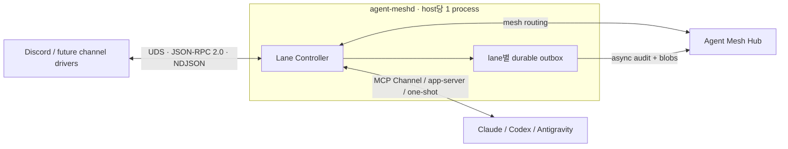

# Agent Mesh Client v0.1 구현 노트

> 상태: **v0.1 구현 완료 후보의 클라이언트 측 결정 기록**
>
> 최종 갱신: 2026-08-16
>
> 대상 저장소: [`sir-mirr/agent-mesh-client`](https://github.com/sir-mirr/agent-mesh-client)
>
> Hub contract: [`sir-mirr/agent-mesh-contracts`](https://github.com/sir-mirr/agent-mesh-contracts)

## 규범 문서가 아니다

**규범 계약은 `sir-mirr/agent-mesh-platform`의 `SPEC.md` 하나다.** 어느 저장소에서든 — 코드 주석, 커밋 메시지, 에이전트 간 서신 — `§ N.N` 참조는 그 문서의 절을 가리킨다.

이 파일은 그 계약을 이 클라이언트가 어떻게 구현하는지에 대한 노트이고 아무도 구속하지 않는다. 2026-08-16까지 이 파일은 `SPEC.md`라는 이름이었고 자기 절 번호를 갖고 있었다. 그래서 양쪽 에이전트가 같은 `§ 9`, `§ 10.1`을 서로 다른 문서에서 읽으면서 각자 자기 문서와 일치하는 구현을 만들었고, 통합 테스트는 계속 통과했다. 이름을 바꾸고 절 번호를 없앤 것은 그 참조가 두 곳을 가리킬 수 없게 하기 위해서다.

여기 적힌 규칙 중 규범이어야 하는 것은 platform SPEC으로 올린다. 클라이언트 구현 사정인 것만 여기 남는다.

## 문서 효력

`MUST`, `SHOULD`, `MAY`는 각각 필수, 권장, 선택 요건을 뜻한다.

- Client 내부 설계가 다른 로컬 문서와 충돌하면 이 문서가 우선한다.
- Hub wire contract는 고정된 `@agent-mesh/contracts` Git tag와 platform SPEC이 우선한다.
- [`docs/open-questions.md`](./docs/open-questions.md)에 v0.1 결정과 후속 항목을 기록한다.
- 사용자가 2026-08-15 개발 착수를 명시적으로 승인했으며, 구현은 이 스펙의 확정 항목부터 진행한다.

## v0.1 범위

v0.1은 다음을 포함한다.

- 호스트당 하나의 `agent-meshd`와 내부의 여러 Lane Controller
- lane별 identity, Hub connection, runtime, UDS, outbox와 Blob spool
- Discord Channel Driver의 실제 연결과 Slack/Telegram 확장을 위한 공통 driver contract
- Claude CLI MCP Channel, Codex app-server, Antigravity one-shot transport를 위한 공통 Runtime Adapter
- Hub를 통한 mesh routing과 비동기 감사 적재
- 설치·설정·운영 TUI와 동등한 비대화형 CLI
- standalone binary와 GitHub Release 기반 배포
- TypeScript 7 계열의 개발 환경

v0.1에서 Slack/Telegram provider 구현, Windows, chunk/resumable Blob upload, GUI와 Hub 서버 구현은 범위 밖이다.

## 확정된 아키텍처

- Channel Driver와 Runtime Adapter의 실시간 경로는 Hub를 거치지 않아야 한다.
- inbound/outbound 메시지와 첨부파일은 Lane Controller가 durable outbox에 기록한 뒤 Hub로 비동기 전송해야 한다.
- 에이전트 간 mesh 메시지는 Hub를 실제 데이터 경로로 사용해야 한다.
- 로컬 outbox 기록 실패 시 신규 channel 메시지를 fail-closed해야 한다.
- Hub 장애는 이미 로컬에 내구성 있게 기록된 channel round-trip을 중단시키면 안 된다.

세부 책임은 [`docs/architecture.md`](./docs/architecture.md)를 따른다.

## Host Daemon과 프로세스 수명주기

- 한 호스트에는 `agent-meshd` process가 정확히 하나만 실행되어야 한다.
- Linux는 `systemd --user`, macOS는 `launchd` user agent로 daemon을 관리해야 한다.
- daemon crash 뒤 OS 사용자 서비스가 재시작해야 하며 lane 상태는 durable state에서 복구되어야 한다.
- TUI 종료, terminal 종료와 tmux detach가 daemon을 종료하면 안 된다.
- tmux는 Claude/Codex 등 대화형 runtime CLI와 선택 observer에만 사용한다.
- Antigravity는 turn마다 one-shot child를 실행하며 상주 runtime process나 별도 daemon을 만들지 않는다.
- Channel Driver는 daemon이 감독하는 별도 child process로 실행할 수 있으며 운영 중 hot add/disable/enable/remove를 지원해야 한다.

결정 근거는 [`docs/adr/0002-single-daemon-user-service.md`](./docs/adr/0002-single-daemon-user-service.md)에 기록한다.

## Lane과 로컬 Channel RPC

- lane마다 독립된 UDS를 사용하고 사용자가 TCP port를 할당하지 않게 해야 한다.
- transport는 JSON-RPC 2.0 over NDJSON이어야 한다.
- 직렬화된 JSON payload는 양방향 최대 `10 MiB`(`10485760 bytes`)이며 LF delimiter는 계산에서 제외한다.
- 첨부파일 bytes와 base64는 frame에 넣으면 안 된다. 검증 가능한 로컬 파일 참조와 metadata만 전달한다.
- Driver의 inbound message 요청은 메시지와 첨부파일이 outbox/Blob spool에 내구성 있게 기록된 뒤에만 성공 응답해야 한다.
- 같은 lane socket에는 여러 driver instance가 연결될 수 있다.
- `driver_instance_id`는 삭제 후 재사용하면 안 된다.
- 세부 method, envelope, ACK와 오류는 [`docs/local-channel-protocol.md`](./docs/local-channel-protocol.md)를 따른다.

## 감사와 첨부파일

- 모든 channel inbound/outbound 본문과 첨부파일 원본을 감사 대상으로 삼아야 한다.
- mesh 메시지는 감사 적재 대상이 아니다. Hub가 실제 데이터 경로라 Hub 자신이 기록하며, adapter가 같이 올리면 같은 봉투가 두 번 기록된다.
- 첨부 bytes의 lowercase SHA-256과 정규화된 extension으로 Blob을 식별해야 한다.
- 같은 SHA-256과 extension은 중복 업로드하지 않아야 한다.
- 파일당 최대 `100 MiB`, event당 최대 32개 및 합계 `256 MiB`를 적용해야 한다.
- chunk/resumable upload는 지원하지 않는다.
- Blob upload 한 번의 timeout은 `180초`이며 실패한 전체 파일을 다음 시도에 처음부터 다시 보낸다.
- Hub가 모든 Blob과 event를 영속 저장한 뒤 반환한 최종 ACK 전에는 event나 원본 Blob을 삭제하면 안 된다.
- Hub 장애 중 미ACK event와 Blob을 기간·횟수 제한 없이 보관하고 재시도해야 한다.
- 영구 오류는 자동 삭제하지 않고 dead-letter에 보존해야 한다.

상태 전이는 [`docs/outbox.md`](./docs/outbox.md), Hub wire는 [`HUB_AUDIT_INTERFACE_PROPOSAL.md`](./HUB_AUDIT_INTERFACE_PROPOSAL.md)를 따른다.

## Runtime 공통 계약

Lane Controller가 channel normalization, Hub connection, audit outbox, queue와 immutable reply correlation을 소유한다. Runtime별 transport는 Agent CLI 연결 차이만 소유한다.

| Runtime | v0.1 transport | Process model | 상세 |
|---|---|---|---|
| Claude | stdio MCP Channel server | tmux 대화형 CLI | [`docs/runtimes/claude.md`](./docs/runtimes/claude.md) |
| Codex | app-server client | 대상 transport에 따라 결정 | [`docs/runtimes/codex.md`](./docs/runtimes/codex.md) |
| Antigravity | `agy --print --output-format json` | inbound turn마다 one-shot child | [`docs/runtimes/antigravity.md`](./docs/runtimes/antigravity.md) |

모든 Runtime Adapter는 다음을 지켜야 한다.

- 실제 reply target은 모델 출력이 아니라 수신 시 저장한 immutable correlation에서 결정한다.
- runtime failure와 timeout을 Hub upload failure와 독립적으로 처리한다.
- thought, hidden reasoning, credential과 내부 secret path를 channel·감사 payload·일반 로그에 노출하지 않는다.
- runtime transport가 재시작되어도 lane outbox와 channel registry를 가능한 한 유지한다.

## Antigravity 확정 정책

- 기본 turn timeout은 `30분`(`1800초`)이다.
- Hub Blob upload timeout `180초`와 별도 상태 머신으로 취급한다.
- lane의 초기 runtime 동시성은 1이며 동일 conversation은 항상 직렬화한다.
- 외부 provider/account/conversation/thread와 workspace identity를 포함해 conversation을 분리한다.
- 고정 최대 연속 turn 수 또는 turn-count 기반 reset을 두지 않는다.
- 사용자의 명시적 reset, workspace identity 변경과 유효하지 않은 conversation 등 의미 기반 조건으로만 reset한다.
- sandbox, workspace 격리, permission mode와 인증 방식은 설치 사용자가 lane별로 선택한다.
- TUI/CLI는 선택된 보안 정책, 실제 적용 여부와 위험도를 표시해야 하며 사용자 선택을 조용히 변경하면 안 된다.

## Hub contract와 identity

- Contract는 공개 `sir-mirr/agent-mesh-contracts`의 immutable Git tag로 소비한다.
- npm registry publish는 v0.1의 전제가 아니다.
- 구현을 시작할 때는 TypeBox runtime schema, Draft 2020-12 JSON artifact와 language-neutral fixture가 포함된 tag를 고정해야 한다.
- lane identity는 Ed25519 key를 사용하고 private key는 lane별 secret으로 분리한다.
- Hub의 동적 `agent_types` registry를 사용하며 Client가 누락된 type을 임의 생성하거나 다른 type으로 fallback하면 안 된다.
- Antigravity lane은 Hub 운영자가 `ai-antigravity(requires_key=1)`를 provision한 뒤 사용한다. type은 붙은 runtime을 가리키며 모델 벤더를 가리키지 않는다 — `agy`가 내부에서 어느 모델에 닿는지는 이 배포가 관측하는 사실이 아니다.
- Lane Controller는 승인된 자기 lane identity로만 `mesh.send`해야 하며 `from` override로 channel 사용자나 다른 참여자를 대리하면 안 된다.
- `mesh.message.from`은 주장된 작성자, `sent_by`는 Hub가 기록한 실제 송신 identity로 취급해야 하며 신뢰 판단에 `from`만 사용하면 안 된다.
- `mesh.list_agents`의 `type=human` 항목은 runtime이 아닌 mesh 참여자다. TUI는 이를 offline agent로 오인해 표시하면 안 되며 v0.1은 client-side type 구분을 사용한다.

호환 기준과 release gate는 [`docs/contract-compatibility.md`](./docs/contract-compatibility.md)를 따른다.

## 설치와 운영 UX

- 최종 사용자는 Bun, Node.js 또는 npm을 설치하지 않고 standalone `agent-mesh` binary를 사용할 수 있어야 한다.
- 선택한 Agent CLI와 대화형 runtime에 필요한 tmux는 사용자가 설치하거나 설치 TUI의 안내를 따라야 한다.
- `install.sh`와 release metadata는 client Git 저장소에서 관리하고 binary/checksum은 GitHub Release로 배포한다.
- 사용자는 Hub base URL 하나만 입력하고 discovery로 RPC/API/upload endpoint를 얻는 것을 기본으로 한다.
- TUI에서 lane과 channel을 생성·수정·기동·중지하고 channel을 hot add/disable/enable/remove할 수 있어야 한다.
- channel remove는 graceful drain, config 삭제와 secret 삭제를 구분해야 한다.
- 모든 핵심 TUI 동작에는 동등한 non-interactive CLI가 있어야 한다.

상세 UX는 [`docs/tui.md`](./docs/tui.md)와 [`TUI_DESIGN.md`](./TUI_DESIGN.md)를 따른다.

## 수용과 동결 조건

- 기능 수용 기준은 [`docs/acceptance-tests.md`](./docs/acceptance-tests.md)의 모든 `MUST` 시나리오로 추적한다.
- v0.1 BLOCKING 항목은 모두 결정됐으며 변경은 별도 revision으로 기록한다.
- 정확한 Claude/Codex transport compatibility와 Antigravity capability는 구현 착수 직전 대상 version으로 다시 검증한다.
- 현재 구현은 이 동결본의 release candidate다.
