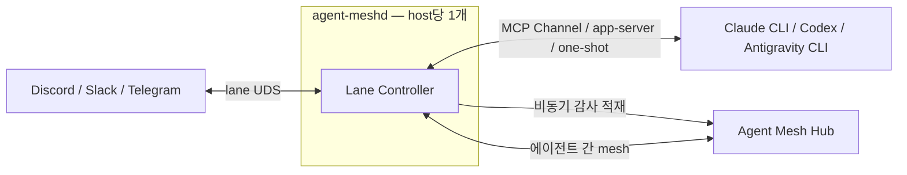
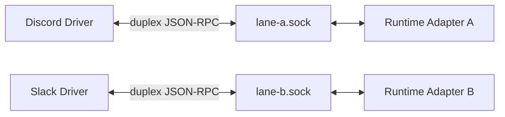

# Agent Mesh Client 요건 및 아키텍처

> 상태: Working Draft / 계속 수정 예정 / 구현 진행 중
>
> 최종 갱신: 2026-08-15
>
> 관련 Hub 저장소: [`sir-mirr/agent-mesh-platform`](https://github.com/sir-mirr/agent-mesh-platform)
>
> Hub 감사 인터페이스 상세: [`HUB_AUDIT_INTERFACE_PROPOSAL.md`](./HUB_AUDIT_INTERFACE_PROPOSAL.md)
>
> TUI 피드백 설계: [`TUI_DESIGN.md`](./TUI_DESIGN.md)
>
> Antigravity Runtime Adapter 설계: [`ANTIGRAVITY_RUNTIME_ADAPTER_DESIGN.md`](./ANTIGRAVITY_RUNTIME_ADAPTER_DESIGN.md)
>
> 클라이언트 구현 노트: [`CLIENT_NOTES.md`](./CLIENT_NOTES.md) · 규범 계약: platform 저장소의 `SPEC.md`

## 1. 문서 목적

이 문서는 한 호스트에서 여러 Agent Mesh lane을 간단히 설치하고 실행하기 위한 클라이언트 도구의 요건과 현재까지 합의된 아키텍처를 기록한다.

사용자가 2026-08-15 개발 착수를 명시적으로 승인했다. 구현은 확정된 기반부터 시작했으며, 설계가 변경되면 이 문서를 기준으로 확정 사항, 제안 사항, 미정 사항을 계속 갱신한다.

## 2. 목표

- Claude CLI, Codex, Antigravity CLI 등 서로 다른 에이전트 런타임을 공통 runtime-adapter로 연결한다.
- Discord를 시작으로 Slack, Telegram 등 여러 외부 채널을 동일한 구조로 확장한다.
- 한 호스트에 여러 lane을 구성해도 포트를 수동으로 관리하지 않는다.
- 설치, 설정, OS 사용자 서비스, 필요한 tmux 세션과 런타임 실행을 하나의 `agent-mesh` 도구로 단순화한다.
- 채널의 실시간 레이턴시는 낮게 유지하면서 모든 inbound/outbound 메시지와 첨부파일을 Hub에 감사 기록한다.
- Hub 장애 중에도 채널 처리를 계속하며 감사 데이터는 lane별 durable outbox에 보관해 나중에 전송한다.
- Hub와 클라이언트가 동일한 버전의 타입, 스키마, 명세를 사용한다.
- 최종 사용자는 내부 포트, 소켓 경로, MCP 설정 파일을 직접 관리하지 않아도 된다.

## 3. 범위 밖

현 단계의 직접적인 범위에는 다음 항목을 포함하지 않는다.

- Agent Mesh Hub의 전체 서버 구현 재설계
- Slack, Telegram 등 모든 provider의 즉시 구현
- 대용량 첨부파일의 chunk 또는 resumable upload
- Windows 및 tmux가 없는 환경의 1차 지원
- GUI 데스크톱 애플리케이션
- 서버 내부 DB, Blob storage, 인증 구현의 npm 공유

## 4. 용어

| 용어 | 의미 |
|---|---|
| Host | `agent-mesh`와 하나 이상의 lane이 실행되는 머신 |
| Lane | 로컬 배포, 런타임 세션, 설정, tmux, 경로와 outbox의 단위 |
| Identity | mesh 위의 영구 에이전트 식별자. lane 이름과 개념적으로 구분되며 Hub가 인증한다 |
| Host Daemon | 호스트당 하나만 실행되는 `agent-meshd` 프로세스. 모든 lane controller와 공통 운영 제어를 소유 |
| Lane Controller | Host Daemon 내부에서 lane별 identity, Hub 연결, UDS, queue, outbox와 runtime 상태를 격리하는 논리 단위 |
| Runtime Adapter | Lane Controller와 runtime transport를 합친 논리적 추상 계층 |
| Runtime Transport | Runtime Adapter core와 개별 CLI의 MCP Channel, app-server, one-shot headless 실행 등 연결 차이를 격리하는 런타임별 계층 |
| Channel Driver | Discord, Slack, Telegram 등 외부 채널 provider와 통신하는 선택 구성요소 |
| Hub | 에이전트 간 mesh 라우팅, 감사 적재, Blob 저장, 관리자 조회를 담당하는 서버 |
| Outbox | Hub 장애 중 감사 이벤트와 첨부파일을 내구성 있게 보관하는 lane 로컬 저장소 |
| Contract | Hub와 클라이언트가 공유하는 타입, 런타임 스키마, 메서드명, 오류 코드, API 명세 |

## 5. 기준 아키텍처

각 lane은 독립된 identity와 runtime-adapter를 가진다. 채널의 실시간 경로는 Hub를 우회하고, 감사 경로와 에이전트 간 mesh 경로만 Hub를 사용한다.



### 5.1. 실시간 채널 경로

```text
Channel Provider ⇄ Channel Driver ⇄ Runtime Adapter ⇄ Agent Runtime
```

- channel-driver와 runtime-adapter는 같은 호스트에서 직접 통신한다.
- Hub는 실시간 채널 메시지 전달 경로에 들어가지 않는다.
- inbound와 outbound 모두 runtime-adapter에서 정규화하고 Hub 감사 이벤트를 생성한다.
- Discord channel-driver는 선택 구성요소이며 runtime-adapter에 직접 연결한다.
- 향후 Slack, Telegram 등도 동일한 channel contract를 구현한다.

### 5.2. 감사 경로

```text
Runtime Adapter → Durable Local Outbox → Agent Mesh Hub
```

- 모든 inbound/outbound 메시지와 첨부파일을 Hub에 저장한다.
- Hub 적재는 실시간 채널 처리를 막지 않는 비동기 경로다.
- Hub 장애 중에는 로컬 outbox가 데이터를 무기한 보관하고 계속 재시도한다.
- 단, 로컬 outbox 기록 자체가 실패하면 감사 보장을 할 수 없으므로 신규 채널 처리를 fail-closed한다.

### 5.3. 에이전트 간 mesh 경로

```text
Runtime Adapter A ⇄ Hub ⇄ Runtime Adapter B
```

에이전트 간 메시지는 기존과 같이 Hub가 실제 데이터 경로가 된다.

### 5.4. 단일 Host Daemon

물리 daemon 프로세스는 호스트당 `agent-meshd` 하나만 실행한다. Lane 수가 늘어나도 daemon 프로세스를 추가하지 않고 daemon 내부에 논리적 `Lane Controller`를 추가한다.

```text
agent-meshd
├── Lane Controller: agent-a
├── Lane Controller: agent-b
└── Lane Controller: antigravity-a
```

각 Lane Controller는 Hub identity와 Ed25519 key, WebSocket connection, lane UDS, driver registry, runtime inbox, turn/correlation state, audit outbox, Blob spool과 runtime health를 서로 분리해 소유한다.

단일 Host Daemon process를 사용해도 Hub credential은 daemon 공용으로 합치지 않는다. identity별 key와 connection을 Lane Controller 경계 안에서 분리한다.

Host Daemon은 TUI/CLI용 control UDS 하나와 lane 데이터 통신용 UDS들을 listen한다.

```text
agent-mesh TUI/CLI → control.sock → agent-meshd
channel-driver/runtime bridge → <lane-hash>.sock → Lane Controller
```

Host Daemon process가 중단되면 모든 lane이 일시적으로 영향을 받는다. Config와 durable state는 lane별로 분리하고 daemon 재시작 후 각 Lane Controller, driver와 runtime bridge가 자동 복구·재연결해야 한다. TUI 종료는 Host Daemon 수명주기에 영향을 주지 않는다.

## 6. 런타임별 연결

### 6.1. Claude

- Claude runtime-adapter는 stdio MCP Channel 서버다.
- Claude CLI는 development channel 옵션으로 해당 MCP 서버를 로드한다.
- `agent-mesh`가 workspace의 MCP 설정을 생성하고 Claude CLI를 tmux에서 실행한다.
- Discord 등 channel-driver가 Hub를 경유하지 않고 해당 lane의 runtime-adapter에 직접 연결한다.

예상 생성 설정의 개념은 다음과 같다.

```json
{
  "mcpServers": {
    "agent-mesh": {
      "command": "/usr/local/bin/agent-mesh",
      "args": ["runtime", "claude", "--lane", "agent-a"]
    }
  }
}
```

실제 Claude CLI 옵션과 MCP 설정 형식은 구현 착수 시 대상 버전에 맞춰 다시 검증한다.

### 6.2. Codex

- Codex runtime-adapter는 Codex app-server client 역할을 한다.
- runtime-adapter의 채널 정규화, Hub 연결, 감사 outbox 동작은 Claude와 동일한 공통 계층을 사용한다.
- Codex app-server가 TCP를 반드시 요구하는 경우에만 loopback 임시 포트를 자동 할당한다.
- stdio를 사용할 수 있는 경우에는 TCP보다 stdio를 우선한다.

### 6.3. Antigravity

- 지원이 종료된 개인용 Gemini CLI ACP 대신 Antigravity CLI `agy`의 one-shot headless transport를 사용한다.
- Runtime Adapter가 inbound turn마다 `agy --print --output-format json` child를 한 번 실행한다. 상주 `agy` process나 별도 adapter daemon은 없다.
- lane당 동시 실행 하나의 직렬 queue를 초기 안전 기준으로 사용하고, 후속 병렬화에서도 동일 `conversation_id`는 직렬화한다.
- 외부 conversation/thread와 Antigravity `conversation_id`를 lane·workspace·source가 포함된 key로 안전하게 매핑한다.
- JSON envelope의 최종 `response`만 외부 회신 후보로 사용한다. `stream-json`과 thought/reasoning 내용은 일반 로그, channel과 감사 payload에 노출하지 않는다.
- Antigravity runtime turn timeout 초기값은 `30분`(`1800초`)이며 첨부파일 upload timeout `180초`와 별도다.
- Hub Blob upload 실패, 감사 ACK 지연과 Hub 연결 단절은 Antigravity turn이나 conversation 수명주기에 영향을 주지 않는다.
- timeout child는 process group을 종료하고 다음 turn은 새 child에서 처리한다.
- 수신 턴의 최종 response는 원 source와 `reply_to`로 자동 회신하는 안을 우선하며, 공통 Agent Mesh MCP는 다른 대상에 대한 능동 발신에 사용한다.
- 고정된 최대 연속 turn 수는 두지 않는다. 명시적 reset, workspace identity 변경, 유효하지 않은 conversation 등 의미 있는 reset 조건만 적용한다.
- sandbox, workspace 격리와 permission mode는 설치 사용자가 lane별로 선택한다. TUI는 선택된 정책과 위험을 표시하고 실제 headless 권한 동작을 compatibility probe로 확인한다.
- 인증, 명시적 child environment, context mapping, MCP와 관측 화면은 [`ANTIGRAVITY_RUNTIME_ADAPTER_DESIGN.md`](./ANTIGRAVITY_RUNTIME_ADAPTER_DESIGN.md)를 따른다.

### 6.4. 공통 Runtime Transport

Host Daemon 내부의 Lane Controller는 Hub 연결, channel UDS, 감사 outbox, turn queue와 correlation을 소유한다. Claude MCP Channel, Codex app-server, Antigravity one-shot 차이는 transport driver로 제한한다. Runtime별 child process가 재시작되어도 해당 Lane Controller, channel-driver 연결과 outbox를 가능한 한 유지한다.

## 7. 멀티 레인과 로컬 IPC

### 7.1. 기본 전송 방식

channel-driver와 Lane Controller의 로컬 전송은 lane별 Unix Domain Socket을 기본으로 한다. 하나의 Host Daemon process가 여러 lane socket을 동시에 listen한다.



- lane마다 TCP 포트를 열지 않는다.
- runtime-adapter가 lane 소켓 하나를 생성한다.
- 한 lane 소켓에 여러 channel-driver instance가 동시에 연결할 수 있다.
- driver가 시작한 단일 지속 연결을 inbound와 outbound에 함께 사용한다.
- driver가 별도의 HTTP callback 포트를 열지 않는다.
- Hub 연결과 외부 provider 연결은 모두 outbound이므로 로컬 수신 포트가 필요 없다.
- wire format은 JSON-RPC 2.0 over NDJSON이며 직렬화된 JSON payload의 최대 크기는 `10 MiB` (`10485760 bytes`)다. 줄 구분자 LF는 크기에 포함하지 않는다.
- 첨부파일 bytes는 JSON frame에 넣지 않고 검증 가능한 로컬 참조와 metadata로 전달한다.

### 7.2. 소켓 경로

소켓 경로는 사용자 설정에 노출하지 않고 `agent-mesh`가 lane ID로부터 결정한다.

```text
Linux: $XDG_RUNTIME_DIR/agent-mesh/<lane-hash>.sock
macOS: 안전한 사용자 전용 임시 runtime directory/<lane-hash>.sock
```

- lane ID를 파일명으로 그대로 사용하지 않고 짧은 안정 해시를 사용한다.
- runtime directory 권한은 `0700`으로 제한한다.
- Host Daemon control socket과 lane socket은 같은 사용자 전용 runtime directory 아래에서 역할별로 분리한다.
- 소켓 권한은 `0600`으로 제한한다.
- stale socket은 실제 listener 부재를 확인한 뒤에만 정리한다.
- runtime-adapter 재시작 시 driver는 지수 백오프와 jitter를 적용해 자동 재연결한다.

### 7.3. 로컬 양방향 계약

초기 메서드 영역은 다음과 같다.

```text
Driver → Runtime Adapter
  channel.register
  channel.message.received
  channel.reaction.received

Runtime Adapter → Driver
  channel.message.send
  channel.message.edit
  channel.message.delete
  channel.reaction.add
  channel.typing.set
```

Driver는 연결 직후 `driver_instance_id`, provider, account, lane, capability를 등록한다. Runtime Adapter는 같은 연결을 통해 해당 driver instance에 outbound action을 전송한다.

### 7.4. 예외 전송

- UDS를 사용할 수 없는 환경은 후속 범위에서 TCP loopback 또는 Named Pipe를 지원할 수 있다.
- TCP가 불가피하면 `127.0.0.1:0`으로 OS가 빈 포트를 자동 할당하게 한다.
- 사용자가 lane별 포트를 직접 지정하거나 충돌을 해결하도록 요구하지 않는다.

## 8. `agent-mesh` 도구

설치 후 사용자가 직접 다루는 최상위 인터페이스는 하나의 `agent-mesh` 명령이다.

```text
agent-mesh                         온보딩 또는 대시보드 TUI
agent-mesh up [lane|--all]         lane 기동
agent-mesh down [lane|--all]       lane 종료
agent-mesh restart <lane>          lane 재시작
agent-mesh attach <lane>           tmux agent window 연결
agent-mesh status                  상태 조회
agent-mesh logs <lane>             로그 조회
agent-mesh config hub set <url>    Hub 위치 저장
agent-mesh config hub show         Hub 위치 조회
agent-mesh config hub test         Hub 연결 검사
agent-mesh daemon status           단일 Host Daemon 상태 조회
```

TUI는 별도 구현체가 아니라 동일한 config와 service 계층을 호출하는 얇은 인터페이스여야 한다. CI나 자동화 환경에서는 같은 기능을 비대화형 CLI로 사용할 수 있어야 한다.

## 9. 설치 및 온보딩 TUI

### 9.1. 최초 실행

설치 후 `agent-mesh`를 처음 실행하면 온보딩 TUI를 연다.

1. Hub 주소 입력 및 연결 검사
2. lane ID, runtime 종류, workspace 선택
3. Claude/Codex/Antigravity 실행 환경과 인증 상태 검사
4. Discord 등 선택 channel 추가 및 비밀값 등록
5. 생성될 설정과 tmux 구성을 요약
6. identity와 Ed25519 key 준비, 공개키 등록, MCP 설정 생성, tmux 세션 생성, runtime과 driver 실행
7. key가 승인됐으면 Hub 연결까지, pending이면 승인 대기 상태까지 health check
8. agent window에 attach

### 9.2. 운영 대시보드

TUI는 최소한 다음 상태를 표시한다.

- Hub 연결 상태와 현재 endpoint
- lane 목록과 identity
- identity key 상태와 fingerprint (`pending`, `approved`, `denied`, `revoked`)
- runtime 종류와 실행 상태
- 연결된 channel-driver 및 capability
- tmux session 이름
- outbox 대기 이벤트 수와 디스크 사용량
- 마지막 Hub ACK 또는 오류

TUI에서 lane 추가·수정·기동·종료·attach·로그 확인·outbox retry를 수행할 수 있어야 한다.

- 실행 중인 lane을 재시작하지 않고 channel-driver instance를 추가, 비활성화, 활성화, 수정, 삭제할 수 있어야 한다.
- channel 삭제는 graceful drain을 기본으로 하며 config 제거와 secret 제거를 분리한다.
- TUI 상세 화면과 상태 전이 계약은 [`TUI_DESIGN.md`](./TUI_DESIGN.md)를 따른다.

## 10. 서비스와 tmux 수명주기

Host Daemon은 tmux가 아니라 OS 사용자 서비스로 호스트당 하나만 실행한다.

```text
Linux: systemd --user → agent-meshd
macOS: launchd user agent → agent-meshd

session: mesh-agent-a
  window: agent       Claude CLI 또는 Codex 세션
  window: observe     선택 로그/관측 화면
```

tmux는 Claude/Codex처럼 대화형 CLI 수명주기와 선택 observer에만 사용한다. Antigravity는 turn마다 one-shot child를 실행하므로 평상시 tmux session을 요구하지 않으며, 인증 PTY나 observer가 필요할 때만 임시 또는 선택 session을 사용한다. TUI 종료와 tmux attach/detach는 Host Daemon 수명주기에 영향을 주지 않는다.

`agent-mesh up agent-a`는 다음 작업을 멱등적으로 수행한다.

1. 설정과 비밀값 검증
2. lane identity와 Ed25519 key 준비, 공개키 등록 또는 현재 승인 상태 확인
3. workspace MCP 설정 생성 또는 갱신
4. 단일 Host Daemon OS 사용자 서비스 설치·상태 확인 및 필요 시 기동
5. Host Daemon에 Lane Controller 생성 또는 기존 상태 확인
6. 기존 lane tmux session 확인
7. 없으면 lane session과 window 생성
8. 선택 channel-driver와 Claude/Codex 대화형 runtime 또는 Antigravity one-shot transport 준비
9. Lane Controller, runtime transport, driver, Hub 상태 확인
10. 대화형 터미널이면 agent 또는 observe window에 attach

이미 정상 실행 중인 session이 있으면 중복 생성하지 않고 attach 또는 상태 표시를 한다.

## 11. 설정 모델

사용자 설정은 가능한 한 작은 단일 파일로 유지한다.

```yaml
version: 1

hub:
  url: https://mesh.example.com

lanes:
  - id: agent-a
    identity: agent-a
    runtime: claude
    workspace: /home/user/work/agent-a
    channels:
      - id: discord-main
        type: discord
```

`lane.id`와 `identity`는 다른 개념이다. 최초 기본값은 같은 문자열을 제안할 수 있지만, identity는 Hub에서 영구적이며 soft delete 후 재사용되지 않는다. TUI는 둘의 차이와 영향 범위를 설명한다.

다음 값은 `agent-mesh`가 자동으로 파생한다.

- 대화형 runtime의 tmux session: `mesh-{lane-id}`
- MCP server 이름: `agent-mesh`
- lane socket 경로
- state, log, outbox, blob spool 경로
- runtime-adapter 실행 인자
- channel-driver 연결 endpoint

비밀값은 YAML에 직접 저장하지 않는다. 사용자 전용 secrets directory의 `0600` 파일 또는 후속 secret provider를 사용한다. lane별 Ed25519 private key도 이 영역에 저장하며 공개키와 fingerprint만 등록·표시한다.

## 12. Hub 위치와 discovery

사용자는 Hub 위치 하나만 지정하는 것을 기본으로 한다.

```bash
agent-mesh config hub set https://mesh.example.com
agent-mesh config hub test
```

설정 우선순위는 다음과 같다.

1. 일회성 CLI 옵션 `--hub`
2. 환경 변수 `AGENT_MESH_HUB`
3. config의 `hub.url`
4. 값이 없으면 온보딩 TUI에서 입력

Hub는 다음 discovery endpoint를 제공하는 방향을 권장한다.

```http
GET https://mesh.example.com/.well-known/agent-mesh
```

```json
{
  "rpc_ws": "wss://mesh.example.com/ws",
  "api_http": "https://mesh.example.com/api/v1",
  "upload_http": "https://mesh.example.com/api/v1/audit/blobs"
}
```

기존처럼 WebSocket과 HTTP 포트가 분리된 Hub를 위해 고급 설정에서는 개별 endpoint override를 허용한다.

```yaml
hub:
  url: https://mesh.example.com
  rpc_ws: ws://10.0.0.10:3100/ws
  api_http: http://10.0.0.10:3000/api/v1
```

## 13. 배포 및 패키징

### 13.1. 사용자 설치 단위

최종 사용자는 하나의 standalone `agent-mesh` 실행 파일을 설치한다. Host Daemon, runtime bridge/transport, TUI와 기본 관리 기능은 이 실행 파일의 subcommand로 제공한다. 물리 daemon은 호스트당 하나만 실행한다.

standalone binary 생성 도구는 구현 착수 전 PoC로 최종 선택한다. 현재 우선 후보는 TypeScript/Bun compile 방식이며, 지원 플랫폼, native dependency, 바이너리 크기, 시작 시간, source map을 검증해야 한다.

### 13.2. GitHub 배포

`install.sh`는 클라이언트 저장소 루트에서 함께 관리한다.

```text
agent-mesh-client/
├── install.sh
├── README.md
├── packages/
└── ...
```

실행 파일은 저장소에 커밋하지 않고 GitHub Release asset으로 배포한다.

```text
agent-mesh-linux-x64
agent-mesh-linux-arm64
agent-mesh-darwin-arm64
SHA256SUMS
```

`install.sh`의 필수 동작은 다음과 같다.

- OS와 CPU architecture 판별
- 최신 또는 지정 버전 Release 선택
- 임시 위치에 실행 파일 다운로드
- SHA-256 checksum 검증
- 시스템 또는 사용자 local bin에 설치
- 기존 버전 교체 시 안전한 atomic replacement
- 설치 후 `agent-mesh --version` 검증

기본 설치와 버전 고정 설치를 모두 지원한다.

```bash
curl -fsSL https://raw.githubusercontent.com/sir-mirr/agent-mesh-client/main/install.sh | sh

curl -fsSL https://raw.githubusercontent.com/sir-mirr/agent-mesh-client/v1.2.0/install.sh \
  | AGENT_MESH_VERSION=v1.2.0 sh
```

실제 저장소 이름과 소유권은 배포 전에 확정한다.

### 13.3. TypeScript

- 신규 클라이언트 프로젝트는 TypeScript 7 계열을 사용한다.
- 구체 버전은 lockfile로 고정한다.
- strict mode를 기본으로 한다.
- 개발용 npm 설치와 standalone binary 배포를 분리한다.

## 14. 공개 GitHub contract package

서버와 클라이언트 사이의 실행 가능한 contract는 별도 공개 GitHub 저장소에서 관리한다.

```text
repository: https://github.com/sir-mirr/agent-mesh-contracts
package:    @agent-mesh/contracts
owner:      Hub/platform team
delivery:   immutable Git tag
registry:   사용하지 않음
```

저장소 루트가 곧 package root다. 초기에는 npm registry에 publish하지 않고 Hub와 client가 동일 Git tag를 직접 설치한다.

```json
{
  "dependencies": {
    "@agent-mesh/contracts": "github:sir-mirr/agent-mesh-contracts#v0.3.0"
  }
}
```

공개 저장소이므로 개발 머신과 CI에 별도 registry token이나 GitHub deploy key가 필요하지 않다. `bun.lock`은 tag가 가리킨 정확한 commit을 고정한다.

`v0.2.0`은 immutable하게 유지하지만 SPEC §15.2의 `AttachmentMeta`가 빠졌으므로 사용하지 않는다. 현재 소비 기준은 이를 추가한 `v0.3.0`이다. 이 tag는 package version `0.3.0`, `agentMeshSpec: "0.2"`를 선언하고 `src/index.ts`와 `fixtures/index.ts`를 직접 export한다.

Hub SPEC은 protocol의 규범적 설명이고 `agent-mesh-contracts`는 타입, runtime schema와 fixture의 실행 가능한 source of truth다. 두 저장소가 어긋나지 않도록 contract release마다 대응 Hub SPEC version과 commit을 metadata에 기록한다.

### 14.1. 포함 항목

- JSON-RPC 메서드명
- 요청과 응답 타입
- 실행 시 사용할 validation schema
- HTTP API와 discovery 명세
- 감사 이벤트와 attachment schema
- 요청 서명, raw params digest, upload authorization와 key lifecycle schema
- 기존 `@agent-mesh/core`의 envelope, tool, capability, ownership, registry, history, action-proxy와 Hub 공통 계약
- channel-driver와 runtime-adapter 공통 계약
- agent type 등록과 `requires_key` 정책의 wire shape. 구체 type 목록은 Hub 운영 데이터이며 contract enum으로 고정하지 않음
- capability 타입
- 오류 코드
- protocol version
- 파일 크기, 해시 알고리즘 등 프로토콜 상수
- cross-language signature, UUIDv7, Blob key, 오류 처리 fixture

### 14.2. 제외 항목

- Hub DB 구현
- Hub 인증과 인가 구현
- Blob filesystem 또는 object storage 구현
- Hub 라우팅과 session 관리 구현
- 서버 내부 business logic
- `@agent-mesh/shared-attachments`의 streaming download, SHA-256 검증과 atomic rename 구현. 이 구현은 lane/client 저장소가 소유하고 `AttachmentMeta`만 contract에서 import함

### 14.3. 배포 원칙

- TypeScript 타입만 제공하지 않고 runtime validation schema를 함께 제공한다.
- schema authoring은 TypeScript 7을 지원하는 TypeBox 1.x(`typebox`)를 사용한다. TypeBox가 만든 JSON Schema object를 canonical source로 하고 TypeScript 타입은 해당 schema에서 정적으로 추론한다.
- wire schema는 JSON Schema Draft 2020-12로 제한하고 coercion, transform과 validation 시 default 삽입을 사용하지 않는다.
- security-critical object의 unknown field 허용 여부와 확장 가능한 envelope의 정책은 schema별로 명시한다.
- Bun + TypeScript 7 소비자는 별도 build 없이 TypeScript source export를 직접 사용한다. `prepare`, committed `dist/`와 declaration-only 배포를 요구하지 않는다.
- 타 언어 소비자를 위해 canonical schema를 `schemas/*.json`, fixture를 `fixtures/*.json`으로도 태그에 포함한다. TypeScript export와 JSON artifact가 byte-equivalent인지 CI에서 검사한다.
- 공개 API는 `package.json`의 `exports`로 제한한다.
- 서버와 클라이언트 CI가 같은 tagged contract commit을 사용해 fixture와 호환성을 검증한다.
- 현재 최소 사용 tag와 package version은 `v0.3.0` / `0.3.0`이다.
- release tag는 보호하고 생성 후 이동하거나 덮어쓰지 않는다.
- contract 변경은 Hub SPEC 변경, contract schema/fixture 변경, 양쪽 CI 통과 후 새 tag 생성 순서로 진행한다.
- npm registry 배포가 필요해지면 동일 package name과 SemVer를 유지한 채 별도 결정으로 추가한다.
- lockfile을 통해 실제 설치 버전을 재현할 수 있어야 한다.

### 14.4. 버전 규칙

| 변경 | SemVer |
|---|---|
| 설명, 내부 수정, 계약 변화 없음 | patch |
| 선택 필드나 호환 가능한 메서드·이벤트 추가 | minor |
| 필수 필드 변경, 의미 변경, 메서드 삭제 | major |

Hub는 discovery 또는 `mesh.connect`에서 자신이 지원하는 protocol과 숫자형 audit protocol version 및 한도를 광고한다. 저장 event는 별도의 숫자형 `schema_version`을 가진다. 둘은 SPEC의 `agentMeshSpec` version과도 구분한다.

### 14.5. `v0.3.0` 확인 결과와 다음 release gate

`v0.3.0`에서 다음 항목은 확인됐다.

- package name/version과 SPEC 0.2 metadata
- TypeScript source 직접 export, build/prepare 단계 없음
- `AttachmentMeta`와 `extractAttachmentsMeta`
- request/upload preimage, `AgentMeshSig` header utility와 upload nonce TTL 900초
- UUIDv7 event ID, Blob key, error classification과 preimage fixture
- 기존 `@agent-mesh/core` 공통 타입의 contract 저장소 편입

다음 contract tag 전 필수 보완은 다음과 같다.

- TypeBox 기반 runtime validation schema와 language-neutral `schemas/*.json`
- TypeScript 코드가 아닌 language-neutral `fixtures/*.json`
- Ed25519 positive/negative, nonce replay, 최초 `mesh.connect`, method/route, Hub 생산 `mesh.*` 저장 fixture
- release metadata에 대응 Hub SPEC commit 고정
- README 설치 예시의 `v0.3.0` 이상 갱신
- GitHub tag protection 설정

`v0.3.0` annotated tag가 실제로 가리키는 commit과 회신의 Bun 설치 출력 SHA가 다르므로 Hub 측이 lockfile과 tag 해석 결과를 한 번 더 대조한다. 기존 tag를 이동하지 않고 정정은 새 tag로 낸다.

## 15. 감사 및 첨부파일 요건 요약

상세 RPC와 HTTP 계약은 [`HUB_AUDIT_INTERFACE_PROPOSAL.md`](./HUB_AUDIT_INTERFACE_PROPOSAL.md)를 따른다.

확정된 핵심 요건은 다음과 같다.

- Runtime Adapter는 channel 감사 이벤트의 생산자이자 lane outbox 소유자다. mesh 감사 이벤트는 Hub가 직접 생산한다.
- 메시지 본문 전체와 첨부파일 원본 전체를 저장한다.
- 파일 content hash는 bytes의 lowercase SHA-256이다.
- 최종 Blob key는 `<sha256>[.<ext>]`이며 dedup 단위는 `(SHA-256, 정규화된 extension)`이다.
- 감사 메시지는 attachment `blob_key`, SHA-256, 원본 filename, MIME과 size를 참조한다.
- 첨부파일 제한은 파일당 `100 MiB` (`104857600 bytes`)다.
- event당 최대 첨부파일은 `32개`, 합계는 `256 MiB` (`268435456 bytes`)다.
- 단일 업로드 시도 timeout은 `180초`다.
- chunk upload와 resumable upload는 지원하지 않는다.
- 실패 시 다음 시도에서 파일 처음부터 전체 업로드한다.
- Hub가 모든 Blob과 감사 이벤트를 영속 저장한 뒤에만 최종 ACK한다.
- 최종 ACK 전에는 outbox 이벤트와 원본 파일을 삭제하지 않는다.
- Hub 장애 중 outbox는 횟수와 기간 제한 없이 보관하고 재시도한다.
- 이벤트 ID는 `aud_<UUIDv7>`을 사용하고 Hub는 동일 event ID와 동일 raw params를 멱등 처리한다.
- `sequence`와 checkpoint는 사용하지 않으며 ACK 유실 시 같은 event ID를 재전송한다.
- Hub가 광고한 `max_inflight_appends`, `max_inflight_uploads`를 지키고 `AUDIT_BUSY`를 처리한다.
- 영구 오류는 조용히 삭제하지 않고 local dead-letter에 원문과 Blob을 보존한다.
- Hub audit event와 참조 Blob은 무기한 보존한다.
- 최종 ACK된 local payload와 다른 미확정 event가 참조하지 않는 Blob은 정리한다. pending/dead-letter는 명시적 처리 전까지 보존한다.
- 감사 기록은 수집된 이벤트의 기록이며 outbox 자체 유실에 대한 완전성 보장은 아니다.

필요한 Hub 신규 인터페이스는 다음과 같다.

```text
mesh.connect 응답 capability 확장
mesh.audit.prepare_blobs
PUT /api/v1/audit/blobs/{blob_key}
mesh.audit.append
관리자 감사 이벤트 조회 HTTP API
```

## 16. 장애 및 복구 정책

| 장애 | 필수 동작 |
|---|---|
| Hub 연결 단절 | 채널 처리 계속, outbox 적재, 무기한 재시도 |
| Blob 업로드 실패 | 원본 보관, 처음부터 재업로드 |
| 180초 업로드 timeout | 현재 시도 중단, 이후 전체 재시도 |
| 감사 ACK 유실 | 동일 event ID와 동일 raw params 재전송 |
| Hub `AUDIT_BUSY` | `retry_after_ms` 이상 대기하고 jitter 적용 |
| Hub `AUDIT_STORAGE_EXHAUSTED` | outbox 유지와 느린 retry, Hub 용량 증설 필요 상태 표시. mesh routing은 계속 |
| 미지원 audit protocol/schema | outbox 유지, 송신 정지, Hub 선행 업그레이드 안내 |
| identity key 승인 대기 또는 폐기 | 채널과 outbox 적재 유지, Hub 기능 대기, 승인·교체 절차 표시 |
| `SIGNATURE_INVALID` | 새 nonce/현재 iat로 재서명하고 local clock, key와 raw serializer 진단 |
| 영구 감사 오류 | active retry 중지, local dead-letter에 원문 보존, 운영 경고 |
| Host Daemon 재시작 | 모든 Lane Controller를 lane별 durable state에서 복구하고 driver/runtime bridge를 재연결 |
| Runtime transport 재시작 | 해당 lane의 queue와 correlation을 유지하고 runtime만 재연결 |
| Channel Driver 연결 단절 | lane UDS에 자동 재연결 |
| 로컬 outbox 기록 실패 | 신규 채널 처리 fail-closed |
| 로컬 디스크 부족 | 신규 채널 처리 fail-closed, TUI와 로그에 경고 |
| tmux session이 이미 존재 | 중복 생성하지 않고 상태 확인 또는 attach |
| stale UDS 파일 | listener 부재 확인 후 안전하게 재생성 |

## 17. 보안 원칙

- Hub identity와 credential은 lane별로 분리한다.
- identity별 Ed25519 private key를 lane secret에 저장하고 공개키만 Hub에 등록한다.
- 등록 key의 fingerprint를 시작 로그와 TUI에 표시하고 관리자 승인 화면과 대조한다.
- 모든 Hub JSON-RPC request는 contract가 정한 request-level signature를 사용한다.
- signature preimage는 `agent-mesh/sig/v1`, method, kid, nonce, decimal iat와 raw params를 uint32be length-prefix로 묶는다.
- request freshness window는 Hub 시각 기준 `±120초`이며 nonce 재사용을 금지한다.
- Blob upload는 `AgentMeshSig` Authorization header를 사용하고 nonce, `blob_key`, SHA-256과 decimal size를 `agent-mesh/upload/v1` domain으로 서명한다.
- upload nonce TTL은 `900초`이며 URL/query가 아니라 Authorization header에 전달한다.
- key rotation과 즉시 revocation을 지원하며 과거 검증을 위해 key history를 삭제하지 않는다.
- Hub는 key 상태를 요청마다 조회하고 rotation/revocation 후 다음 요청에서 이전 key를 거부한다.
- 단일 Host Daemon 안에서도 credential reference, state directory, outbox DB와 log context를 lane별로 분리한다.
- provider token은 channel-driver만 보유한다.
- provider token을 Runtime Adapter나 Hub 감사 payload로 전달하지 않는다.
- credential, Authorization header, secret 파일 내용은 로그와 감사 이벤트에서 제거한다.
- Runtime의 thought, chain-of-thought, reasoning 전용 stream은 채널 메시지, Hub 감사 payload와 일반 운영 로그에 포함하지 않는다.
- UDS directory와 socket은 현재 사용자만 접근할 수 있게 한다.
- Hub RPC와 HTTP upload는 운영 환경에서 TLS를 사용한다.
- `install.sh`는 Release asset의 SHA-256을 검증한다.
- Hub 관리자 조회 권한과 lane 감사 적재 권한을 분리한다.

## 18. 구현 수용 조건

- 한 명령으로 설정 검증, OS 사용자 서비스, 필요한 tmux 구성, runtime과 driver 기동이 완료된다.
- 한 호스트에는 lane 수와 관계없이 `agent-meshd` daemon process가 하나만 실행된다.
- 하나의 Host Daemon 안에서 각 lane의 identity, Hub connection, UDS, outbox와 runtime state가 논리적으로 분리된다.
- 여러 lane을 띄워도 lane별 TCP 포트를 수동 설정하지 않는다.
- 한 lane에 동일 provider 또는 서로 다른 provider의 여러 driver가 연결된다.
- Channel RPC는 JSON-RPC 2.0 over NDJSON과 payload당 `10 MiB` 제한을 양방향으로 강제하며 첨부파일 bytes를 frame에 넣지 않는다.
- 실행 중인 lane에서 channel-driver instance를 hot add/remove할 수 있다.
- channel-driver를 삭제해도 Hub 감사 기록과 미전송 outbox 항목이 삭제되지 않는다.
- Channel Driver와 Runtime Adapter는 Hub 장애와 무관하게 직접 통신한다.
- Hub 장애 중 생성된 감사 데이터가 로컬에 남고 복구 후 자동 적재된다.
- 동일 이벤트 재전송은 Hub 중복 레코드를 만들지 않는다.
- 같은 bytes와 같은 extension의 첨부는 중복 저장하지 않으며, 다른 extension은 별도 key로 저장될 수 있다.
- identity key pending을 정상 기동 대기 상태로 표시하고 승인 후 자동 연결한다.
- key fingerprint 확인, rotation과 revocation 상태를 TUI/CLI에서 추적할 수 있다.
- signature fixture, `±120초` freshness, nonce replay와 요청별 key 상태 검증을 통과한다.
- `AUDIT_BUSY`, `AUDIT_STORAGE_EXHAUSTED`, negotiated in-flight 제한과 permanent dead-letter를 처리한다.
- Hub audit volume이 소진돼도 mesh routing은 계속되고 client outbox가 감사 event를 보관한다.
- Claude, Codex, Antigravity adapter가 공통 channel, Hub, audit 계층을 재사용한다.
- Antigravity의 연속 turn이 직렬 순서를 보존하고 정확한 source와 `reply_to`로 한 번 응답한다.
- Antigravity conversation은 임의의 고정 turn 수로 강제 reset하지 않는다.
- Antigravity의 설치 사용자 선택 보안 정책과 실제 적용 상태를 TUI/CLI에서 확인할 수 있다.
- Antigravity JSON의 최종 response 외의 thought/tool detail이 Hub, channel과 일반 관측 로그에 노출되지 않는다.
- Antigravity turn timeout child가 종료되고 그 출력이 다음 turn에 혼입되지 않는다.
- 서로 다른 external conversation, thread, peer와 workspace의 Antigravity context가 섞이지 않는다.
- 사용자가 Hub 주소 하나만 입력해도 필요한 RPC와 HTTP endpoint를 찾을 수 있다.
- 사용자가 MCP 설정과 UDS 경로를 직접 작성하지 않아도 된다.
- 설치 스크립트가 올바른 플랫폼 바이너리를 선택하고 checksum을 검증한다.
- Hub와 클라이언트가 `sir-mirr/agent-mesh-contracts`의 동일 immutable tag로 fixture와 호환성 테스트를 통과한다.
- Hub와 클라이언트가 동일한 TypeBox/JSON Schema로 모든 inbound wire payload를 runtime 검증한다.

## 19. 확정된 결정

- Lane마다 독립 identity와 runtime-adapter를 둔다.
- 물리 daemon은 호스트당 하나만 두고 lane별 Runtime Adapter는 내부 `Lane Controller`로 구성한다.
- Claude도 다른 런타임과 동일한 runtime-adapter 추상화를 사용한다.
- Antigravity CLI도 동일한 runtime-adapter core를 사용하고 런타임 차이는 one-shot transport로 격리한다.
- Antigravity는 상주 child/session 없이 inbound turn마다 JSON one-shot child를 실행한다.
- Antigravity는 초기 lane-wide 직렬 queue와 external conversation별 context mapping을 사용한다.
- Antigravity 수신 턴은 최종 response를 correlation에 따라 자동 회신하고 Agent Mesh MCP는 능동 발신에 사용한다는 안을 우선한다.
- Antigravity runtime identity는 모델 벤더와 분리해 `ai-cli-adapter`를 제안하고 실제 model은 runtime metadata에 기록한다.
- Hub agent type은 닫힌 contract enum이 아니라 운영자 관리 registry다. `ai-cli-adapter`는 Hub 운영자가 `requires_key=1`로 provision하며 클라이언트가 임의 생성하지 않는다.
- Discord driver는 선택 구성요소다.
- 채널 실시간 메시지는 driver와 runtime-adapter가 직접 처리한다.
- inbound/outbound 감사 기록은 runtime-adapter가 Hub로 보낸다.
- 에이전트 간 mesh 메시지는 Hub를 경유한다.
- mesh 메시지의 감사 이벤트는 Hub가 직접 생산하고 원본 발신 signature를 보존한다.
- Hub 장애 중 outbox와 첨부파일을 무기한 보관하고 재시도한다.
- 첨부파일은 SHA-256과 정규화된 extension으로 content addressing하며 dedup 단위도 그 조합으로 한다.
- 파일당 100 MiB, event당 32개/합계 256 MiB, 시도당 180초, chunk/resume 미지원으로 한다.
- Hub 최종 ACK는 Blob과 감사 이벤트가 모두 저장된 뒤에만 반환한다.
- 감사 event ID는 UUIDv7 기반으로 하고 sequence/checkpoint는 제거하는 안을 채택한다.
- lane identity는 Ed25519 key를 사용하며 승인 전 pending을 정상 대기 상태로 처리한다.
- 요청별 서명은 domain-separated uint32be length-prefix preimage와 `±120초` freshness/nonce replay 방지를 사용한다.
- Blob upload Authorization은 `AgentMeshSig`와 `agent-mesh/upload/v1` preimage, 900초 nonce TTL을 사용한다.
- identity의 unsigned 허용 여부는 Hub `agent_types.requires_key`가 결정한다. `requires_key=1`은 key가 없으면 `KEY_NOT_APPROVED/missing`, `requires_key=0`도 승인 key가 존재하면 서명을 강제한다.
- Hub는 identity key 상태를 요청마다 읽고 rotation/revocation 뒤 이전 key를 즉시 다음 요청부터 거부한다.
- 영구 감사 오류는 local dead-letter에 보존한다.
- Hub audit event와 참조 Blob은 무기한 보존하고 감사 용량 소진은 `AUDIT_STORAGE_EXHAUSTED`로 라우팅과 분리한다.
- 최종 ACK된 local payload와 미참조 Blob은 정리하고 pending/dead-letter는 보존한다.
- 여러 lane의 로컬 통신은 TCP 포트 대신 lane별 UDS를 기본으로 한다.
- Channel RPC는 JSON-RPC 2.0 over NDJSON, 최대 frame `10 MiB`로 한다.
- Host Daemon은 Linux `systemd --user`, macOS `launchd` 사용자 서비스로 관리하고 tmux는 대화형 CLI에만 사용한다.
- 설치와 운영의 사용자 인터페이스는 단일 `agent-mesh` 도구로 통합한다.
- TUI에서 channel-driver instance를 운영 중 추가·비활성화·활성화·삭제할 수 있게 한다.
- channel 삭제 시 graceful drain을 기본으로 하고 config와 secret 삭제를 구분한다.
- Hub 주소는 TUI와 `agent-mesh config hub`로 지정할 수 있어야 한다.
- `install.sh`는 Git 저장소에서 관리하고 바이너리는 GitHub Release로 배포한다.
- 신규 클라이언트는 TypeScript 7 계열을 사용한다.
- 공개 `sir-mirr/agent-mesh-contracts` 저장소에는 구현체가 아니라 타입, 스키마, 상수와 fixture만 둔다. Hub/platform 팀이 소유하고 immutable Git tag로 배포한다.
- Contract runtime schema는 TypeBox를 canonical authoring layer로 사용하고 Draft 2020-12 JSON artifact를 함께 제공한다.
- 기존 `@agent-mesh/core` 계약은 `@agent-mesh/contracts`로 통합하고 attachment fetch 구현은 lane/client 저장소가 소유한다.

## 20. 미정 및 후속 결정 항목

### 20.1. 채널과 감사

- provider 원본 raw event 전체 저장 여부
- 채널별 지원 capability의 최소 필수 집합
- Runtime Adapter가 재시작 중일 때 Channel Driver가 inbound를 임시 보관할지 여부

### 20.2. 보존과 저장

- Outbox 최대 디스크 사용량과 운영 경고 임계값
- Hub에서 어떤 event도 참조하지 않은 orphan Blob의 유예 기간
- `hub.db:messages`의 배포별 회전 기간
- Hub audit 별도 volume의 soft/hard threshold와 경보 채널
- Hub audit/blob 저장소 암호화 방식

### 20.3. 인증과 운영

- unsupported 상위 `schema_version`의 정확한 오류 코드
- 관리자 감사 조회 권한 모델
- UDS peer credential 외에 lane별 로컬 인증 토큰이 필요한지 여부
- `agent-mesh config hub set` 시 identity를 즉시 provision할지 최초 `up`에서 할지 여부
- 단일 process address space에서 lane credential을 추가로 격리할 방법이 필요한지

### 20.4. 배포

- 공개 contract 저장소의 branch/tag protection과 maintainer 권한 설정
- `v0.3.0` README의 오래된 `v0.2.0` 설치 예시와 tag/lockfile commit SHA 불일치 확인
- TypeBox runtime schema, JSON schema/fixture artifact와 미커버 fixture를 포함한 다음 contract tag
- standalone binary 생성 도구 최종 선택
- 지원할 Linux 배포판과 최소 glibc 버전
- macOS x64 지원 여부
- installer 기본 설치 경로와 sudo 사용 정책
- 자동 업데이트 지원 여부
- GitHub 저장소의 최종 이름

### 20.5. 런타임

- Hub 운영자가 `ai-cli-adapter(requires_key=1)` type을 기본 seed에 넣을지 배포별로 provision할지 여부
- Codex app-server 연결의 최종 transport와 수명주기
- Claude CLI 및 MCP 설정 파일의 버전별 호환 정책
- 지원할 Antigravity CLI 최소/최대 version과 capability compatibility matrix
- Antigravity 자동 response 회신과 MCP-only mode의 최종 정책
- Antigravity conversation reset 조건, resume 실패와 문맥 복구 정책. 고정 최대 turn 수는 사용하지 않음
- Antigravity model 고정 여부, model 변경 시 context 정책과 quota 표시
- Antigravity 설치 사용자 선택 security profile의 종류·표시 방식과 OAuth/API-key 기본 방식
- Antigravity attachment를 runtime에 노출하는 방식과 지원 형식
- 대화형 runtime tmux session/window 구성을 사용자 지정 가능하게 할지 여부
- CLI, driver와 runtime child crash 시 자동 재시작 정책

## 21. 설계 단계 진행 순서

개발 착수 전 다음 순서로 설계를 구체화한다.

1. Hub contract와 discovery 형식 확정
2. Channel Driver ↔ Runtime Adapter 로컬 JSON-RPC 계약 확정
3. 단일 Host Daemon과 Lane Controller의 설정, 디렉터리, identity와 credential 수명주기 확정
4. Outbox 저장 모델과 장애 상태 머신 확정
5. Claude/Codex/Antigravity runtime별 transport, 프로세스와 tmux 수명주기 확정
6. TUI 화면 흐름과 비대화형 CLI 계약 확정
7. Release asset, installer, 업데이트 정책 확정
8. 수용 테스트와 호환성 테스트 목록 확정

## 22. 변경 이력

| 날짜 | 변경 |
|---|---|
| 2026-08-15 | 초기 통합 문서 작성. Runtime Adapter 중심 구조, Hub 감사, UDS 멀티 레인, TUI/tmux, Hub discovery, GitHub 배포, npm contract 공유, TypeScript 7 요건을 반영 |
| 2026-08-15 | TUI 피드백 설계 문서 연결. 실행 중 channel-driver 추가·비활성화·삭제와 graceful drain 요건 반영 |
| 2026-08-15 | Gemini CLI ACP 파일럿 반영. 공통 Runtime Transport, 직렬 turn queue, thought 차단, timeout session 격리, Gemini identity와 TUI 요건 추가 |
| 2026-08-15 | Gemini runtime turn timeout 기본값을 30분(1800초)으로 변경. 첨부파일 upload timeout 180초는 유지 |
| 2026-08-15 | Hub 감사/Blob upload 장애와 Gemini ACP session 수명주기를 완전히 분리한다고 명시 |
| 2026-08-15 | 물리 daemon을 lane별 process가 아닌 호스트당 단일 `agent-meshd`로 확정하고 lane은 내부 controller로 격리 |
| 2026-08-15 | Hub 회신 반영. identity별 Ed25519 key와 승인 수명주기, 요청별 서명, UUIDv7 event ID, sequence/checkpoint 제거안, `(SHA-256, extension)` Blob key, 동적 한도와 busy 처리, permanent dead-letter, Hub 생산 mesh 감사 추가 |
| 2026-08-15 | Hub 문서의 sequence 불일치, nonce/iat가 서명 대상에 묶이지 않는 replay 문제와 폐기 key 연결 cache 무효화를 구현 전 확인 항목으로 지정 |
| 2026-08-15 | Hub 2차 회신/SPEC 0.2 반영. length-prefixed signature, ±120초 freshness, 요청별 key 조회, KEY_NOT_APPROVED, AUDIT_STORAGE_EXHAUSTED와 Hub 무기한 보존 확정 |
| 2026-08-15 | contract package를 `@agent-mesh/contracts`로 선택. unkeyed identity 우회, `ai-gemini` enum 누락과 Blob PUT wire 형식을 후속 확인으로 기록 |
| 2026-08-15 | contract를 공개 `sir-mirr/agent-mesh-contracts` 저장소의 immutable Git tag로 배포하기로 확정. 초기 tag `v0.2.0`, npm registry publish는 보류 |
| 2026-08-15 | Gemini ACP 설계를 Antigravity CLI one-shot JSON transport로 교체. 단일 Host Daemon, 30분 turn timeout과 Hub upload 독립성 유지 |
| 2026-08-15 | Antigravity conversation mapping, 자동 correlation 회신/MCP 능동 발신 분리, `ai-cli-adapter` identity 제안과 sandbox 재검증 요건 추가 |
| 2026-08-15 | Hub 3차 회신 반영. 공개 contract `v0.3.0`, dynamic `agent_types.requires_key`, `AgentMeshSig` upload wire와 900초 TTL을 확정 |
| 2026-08-15 | Runtime schema를 TypeBox + Draft 2020-12 JSON artifact로 결정. 기존 core 통합, attachment fetcher의 lane 소유와 다음 contract release gate 기록 |
| 2026-08-15 | Channel RPC frame 상한을 10 MiB로 확정. Host Daemon을 systemd user/launchd 사용자 서비스로 관리하고 tmux를 대화형 CLI 용도로 한정 |
| 2026-08-15 | Antigravity 고정 최대 연속 turn 수를 제거하고, lane별 보안 정책은 설치 사용자가 선택하며 turn timeout은 30분으로 유지 |
