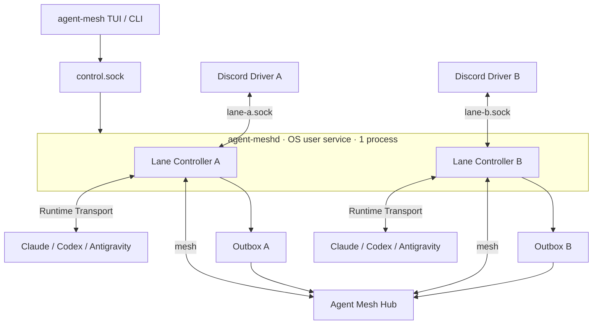

# v0.1 아키텍처

> 상태: v0.1 implemented

## 구성



## 책임 경계

| 구성요소 | 소유 책임 | 소유하지 않는 책임 |
|---|---|---|
| `agent-mesh` | 설치, config, TUI/CLI, service 제어 | provider API, runtime 추론 |
| `agent-meshd` | control UDS, lane lifecycle, driver supervision | 사용자 대화 UI |
| Lane Controller | identity, Hub, Channel RPC, normalization, correlation, queue, outbox | provider credential, runtime 고유 protocol 세부 |
| Runtime Transport | Claude MCP, Codex app-server, Antigravity one-shot 변환 | Hub audit DB, provider API |
| Channel Driver | provider connection, token, provider event/action 변환 | Hub 연결, Runtime CLI 제어 |
| Hub | mesh routing, audit/Blob durable storage, 조회 | local channel realtime relay |

## 데이터 경로

### Channel inbound

```text
Provider → Driver → lane UDS → durable audit staging → runtime queue → Agent CLI
```

Driver 요청은 durable staging 뒤 ACK한다. Hub 적재 완료는 runtime queue 진입의 선행조건이 아니다.

### Channel outbound

```text
Agent CLI → immutable correlation → durable outbound intent → lane UDS → Driver → Provider
                                          └→ async Hub audit
```

### Mesh

```text
Runtime Adapter A ⇄ Hub ⇄ Runtime Adapter B
```

Hub가 mesh event의 감사 생산자이며 Client는 Hub가 보낸 원본 identity/correlation을 보존한다.

## 수명주기

- OS login/session에서 user service가 `agent-meshd` 하나를 관리한다.
- daemon은 config revision을 읽고 Lane Controller들을 생성·복구한다.
- driver는 필요할 때 supervised child로 hot add/remove한다.
- Claude/Codex 대화형 CLI는 lane별 tmux session에서 실행할 수 있다.
- Antigravity는 queue item마다 child를 spawn하고 완료 후 제거한다.
- daemon restart 뒤 outbox, context mapping과 pending correlation을 durable state에서 복구한다.

## 포트 정책

- lane은 UDS를 사용하며 사용자 설정 TCP port가 없다.
- Hub와 provider 연결은 outbound이다.
- Codex app-server가 TCP만 지원할 때에만 loopback `127.0.0.1:0`을 자동 할당한다.
- Windows Named Pipe와 일반 TCP fallback은 v0.1 범위 밖이다.
