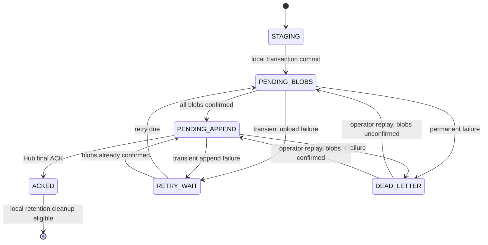

# Lane Audit Outbox v0.1

> 상태: v0.1 implemented

## 1. 목적과 불변 조건

Outbox는 Hub의 가용성과 무관하게 channel message와 attachment를 먼저 로컬에 내구성 있게 보존한다.

- lane마다 논리적으로 독립된 event store와 Blob spool을 사용한다.
- 성공적인 inbound ACK 전에 event row, correlation과 모든 Blob bytes가 durable해야 한다.
- Hub 최종 ACK 전 event와 참조 Blob을 삭제하면 안 된다.
- Hub 장애 중 retry 횟수와 보존 기간에 제한을 두지 않는다.
- permanent failure는 dead-letter로 이동하되 원문과 Blob을 보존한다.
- local durability를 확보할 수 없으면 신규 channel 처리를 fail-closed한다.

## 2. 논리 상태



`STAGING`은 외부에 수락을 알리기 전의 transaction 내부 상태다. process crash 뒤 commit되지 않은 staging file은 복구 검사에서 격리·정리한다.

## 3. 논리 레코드

### Event

```text
event_id                 aud_<UUIDv7>
lane_id
direction                inbound | outbound
source_kind              channel | mesh
driver_instance_id       nullable
schema_version
raw_params_bytes
raw_params_sha256
attachment_blob_keys[]
state
attempt_count
next_attempt_at
last_error_code
created_at / updated_at / acked_at
```

### Blob

```text
blob_key                  <sha256>[.<normalized-ext>]
sha256
normalized_extension
size
spool_path
local_ref_count
hub_confirmed
created_at / last_verified_at
```

### Delivery outcome

Outbound provider 호출은 안정된 `action_id`와 결과를 별도로 기록해 daemon/driver reconnect 시 중복 전송을 방지한다.

## 4. 저장과 commit 순서

Inbound 수락 순서는 다음과 같다.

1. frame과 attachment metadata 제한을 검증한다.
2. staging file을 안전하게 열고 size/SHA-256을 재계산한다.
3. content-addressed Blob spool에 copy하고 파일을 durable flush한다.
4. event, Blob reference와 immutable correlation을 하나의 local DB transaction으로 commit한다.
5. DB와 필요한 directory metadata를 durable flush한다.
6. Driver에 accepted ACK를 반환한다.
7. runtime queue와 Hub audit worker에 event를 공개한다.

Hub 적재는 Blob prepare/전체 PUT, audit append 순서로 진행한다. Hub가 Blob과 event를 모두 확인한 final ACK를 반환해야 `ACKED`로 전환한다.

## 5. Retry 분류

| 분류 | 동작 |
|---|---|
| network/timeout/5xx | backoff + jitter 뒤 전체 request 재시도 |
| Hub `AUDIT_BUSY` | `retry_after_ms` 이상 대기 |
| `AUDIT_STORAGE_EXHAUSTED` | 느린 retry, 강한 운영 경고, event/Blob 유지 |
| signature clock/nonce 문제 | 새 nonce/iat로 재서명하고 clock/key 진단 |
| protocol/schema 상위 incompatibility | 송신 정지, payload 유지, Hub 선행 upgrade 안내 |
| permanent validation/identity 오류 | dead-letter 격리, 자동 hot retry 중지 |
| 분류되지 않은 코드 | 호출 지점이 정한다. 감사 경로는 `transient` — 잘못된 재시도는 backoff 상한 안이고 큐가 흡수한다 |

dead-letter는 격리이지 삭제가 아니며, `agent-mesh outbox replay --lane ID [--event-id ID ...]`로 다시 큐에 넣는다. 첨부가 미확인이면 `PENDING_BLOBS`로, 확인됐으면 `PENDING_APPEND`로 복귀한다. DEAD_LETTER가 아닌 event는 거부한다 — ACKED를 되돌리면 Hub가 이미 받은 event를 재전송한다. `attempt_count`와 `last_error_code`는 유지한다. 이 명령이 필요한 대표 사례는 버전 스큐다: client가 모르는 코드를 호출 지점 기본값으로 분류했고 그 판단이 틀린 경우, 멈춘 event들은 정상이며 다음 시도에서 append된다.

Blob upload는 chunk/resume하지 않는다. 180초 timeout이나 중간 실패 뒤 다음 attempt에서 file 처음부터 다시 PUT한다.

## 6. Cleanup

- `ACKED` event는 local retention 정책을 만족한 뒤 제거할 수 있다.
- 어떤 pending/retry/dead-letter event도 참조하지 않고 Hub-confirmed인 Blob만 local cleanup 후보가 된다.
- pending, retry와 dead-letter event/Blob은 자동 용량 회수를 위해 삭제하면 안 된다.
- Driver/channel/lane config 삭제가 outbox cleanup을 암시하면 안 된다.
- v0.1은 ACKed event와 Blob도 자동 삭제하지 않는다. 후속 retention 정책이 명시된 뒤에만 cleanup을 활성화한다.
- Hub의 audit event와 참조 Blob 보존은 Hub 정책상 무기한이다.

## 7. 동결 대기 기본값

다음은 구현 가능한 후보이나 아직 규범 값으로 동결되지 않았다.

| 항목 | 현재 후보 |
|---|---|
| storage | lane별 SQLite, WAL, `synchronous=FULL` + content-addressed file spool |
| 일반 retry | 1초부터 5분까지 exponential backoff + jitter |
| storage exhausted retry | 10분부터 1시간까지 느린 backoff |
| lane별 quota | 20 GiB |
| warning | quota 80% |
| fail-closed | quota 95% 또는 filesystem free 5 GiB 미만 |

정확한 값은 [`open-questions.md`](./open-questions.md)의 `OQ-01`에서 확정한다.
